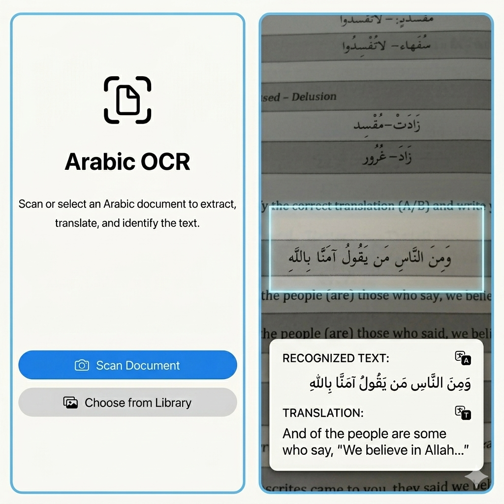

# Arabic OCR

An iOS app that scans printed Arabic documents, extracts the text, and returns an English translation powered by Claude API in the backend.



## Features

- **Full Page** — captures the entire camera frame and sends it for OCR
- **Lines** — crops to a narrow horizontal band so you can isolate a single line of text
- **Photo Library** — pick an existing image instead of using the camera
- **Results** — shows the recognised Arabic text (right-to-left) alongside the English translation and source

## Requirements

- iOS 26+
- Xcode 26+
- Backend [arabic-ocr-backend](https://github.com/azhaider/arabic-ocr-backend) on RunPod (or any compatible FastAPI endpoint)

## Setup

1. Clone the repo
2. Copy the backend config template and fill in your RunPod URL:
   ```
   cp ArabicOCR/Config.swift.example ArabicOCR/Config.swift
   ```
3. Open `ArabicOCR.xcodeproj` in Xcode, select your target device, and run

> `Config.swift` is git-ignored so your endpoint URL is never committed.

## Architecture

| Layer | Files |
|---|---|
| Views | `ContentView`, `ResultsView`, `CameraView`, `PhotoPickerView`, `LoadingView`, `CropBandView` |
| View Model | `ContentViewModel` — owns OCR state, task lifecycle, and cancellation |
| Camera | `CameraViewController` + `CameraSession` — AVFoundation capture on a dedicated serial queue |
| Service | `OCRService` — multipart upload to the FastAPI backend |
| Models | `OCRResult`, `OCRError` |
